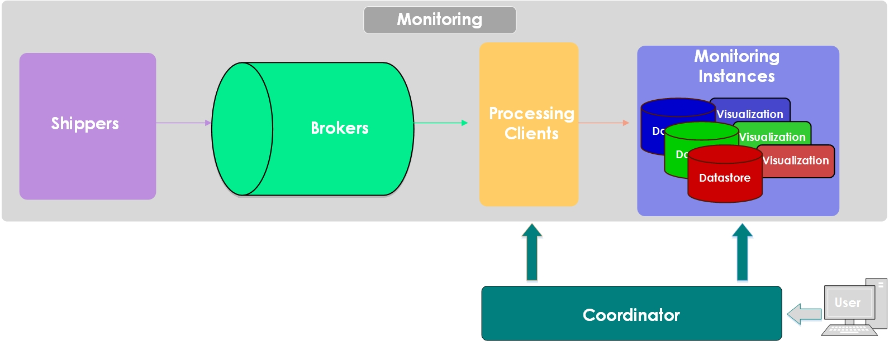

# 

## Introduction

This repository contains Smonnet which is a Kafka Consumer, a Data Processor and Segregator and an Elasticsearch Indexer. Smonnet is an abbreviation of *Sflow MONitor NETwork* and it is pronounced like the famous French painter Monet.

This tool is part of my Master thesis project which has to do with network Monitoring as a Service (MaaS) and has many characteristics of a Virtual Network Function (VNF). 

Smonnet can be accessed through *ProcAPI* a REST API in all of the processing clients of the platform which run multiple instances of it. A high level overview of the _Monitoring as a Service_ architecture is the following:


An overview of the internal stages of Smonnet are shown in the following picture:


* it connects to a Kafka cluster to get stored sflow messages
* it filters all the messages to get the ones which coresponds to a specific user e.g. vlan=42 or an srcIP=1.2.3.4 (ranges cannot be applied for now)
* it enriches the filtered messages with:
    * geographical information about the origins of an IP
    * IP mappings of the source and destination through a *IPmap.json* file
* it propagates batches of the processed messages to a specific Elasticsearch cluster

Details:
- each user can be a tenant of a network i.e. a lab of a university network
- each user is a separate Kafka consumer group
- each process coresponds to a specific user
- more processes or smonnet instances for a specific user can lead to faster processing and indexing to Elasticsearch
- each batch is splitted in many threads
- a new user can be notified through a *SIGHUP* signal to the running parent process of smonnet (through ProcAPI) and then it reads the new information from the config file (or better from a database)


## Installation for a development environment

You can clone the repository and install it and its dependencies
in a local virtual environment (this requires the *python-virtualenv* package).

    $ git clone <repo_url>
    $ cd smonnet
    $ virtualenv venv
    $ source venv/bin/activate
    $ pip install -r requirements.txt
    $ python smonnet.py


## Configuration

### Hardcoded parameters
- Configure Kafka cluster in class _Initialize_ in method _SetupConsumer_
- The paths of the _api.cfg_ in the main function
- The path of the _Maxmind datasets_ at the initialization of the MessageHandler class
- The path to the _template_ that is sent during the initialization of the Elasticsearch connection from MessageHandler class

### Configuration file
In it's current, very initial version, the code expects a configuration file (ProcAPI has a similar configuration file as well). It is used to configure:
- the names of the elasticsearch clusters (users)
- the nodes of the elasticsearch cluster
- the filters to segregate the traffic for a specific user
*api.cfg* looks like the the following example :
```
[smonit]
max_param_filters = 1
processing_pid = 123
child_procs = 124,125
monitor_names = user1-user2
monitor_params = sflow_dstVlan,42-sflow_dstIP,1.2.3.4
monitor_nodes = esnode1:9200,esnode2:9200--esnode3:9200,esnode1:9201
new_monitor = add,sflow_dstVlan,42,user1,esnode2:9201,esnode3:9201
```

This product includes GeoLite2 data created by MaxMind, available from
<http://www.maxmind.com>.

